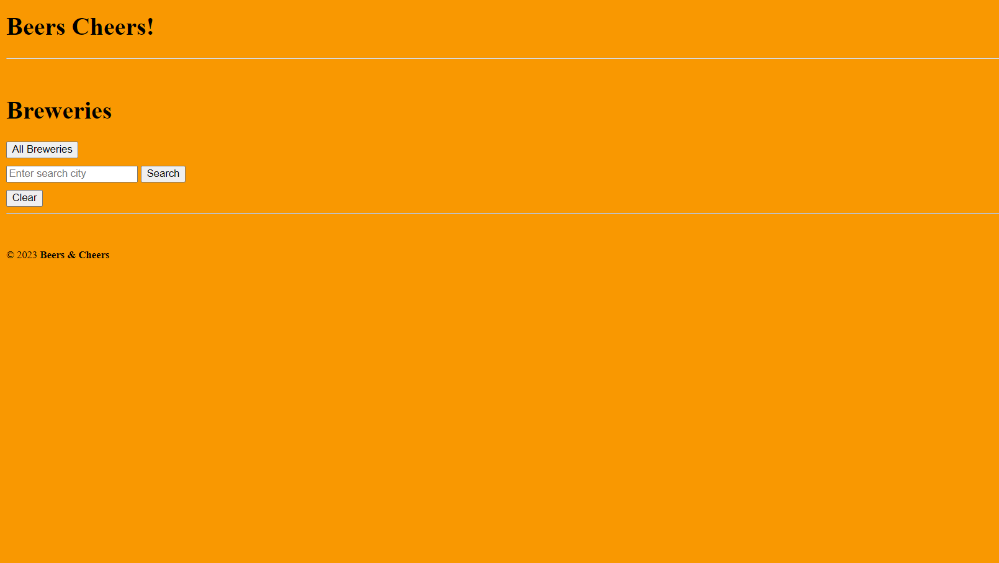

# Introduction:
This web application allows users to search for breweries in all cities within the United States of America. Once brewery option is confirmed, users will be able to get the name, address, and website; should that information be available. If there are no breweies there will be a prompt, "Sorry, No Breweries in that City!"

# Page Preview:

# Technologies:
This web application uses JavaScript, HTML, and CSS.

# Credits:
API provided by Open Brewery DB; a free dataset and API with public information on breweries. 

https://www.openbrewerydb.org/documentation

https://api.openbrewerydb.org/breweries
